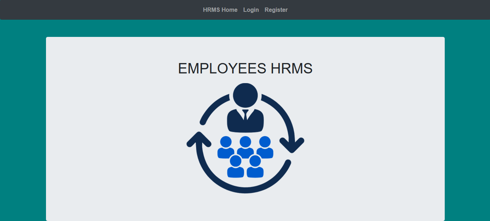
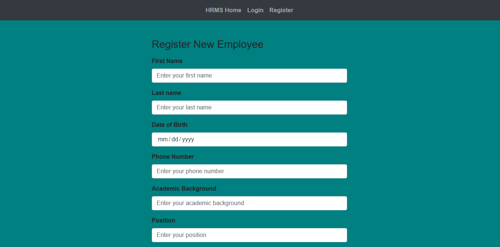
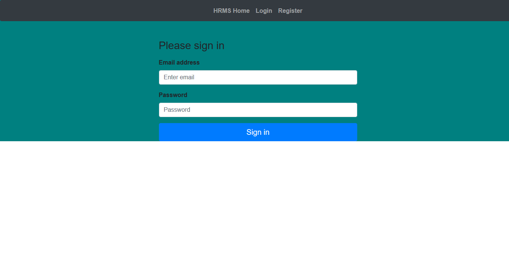
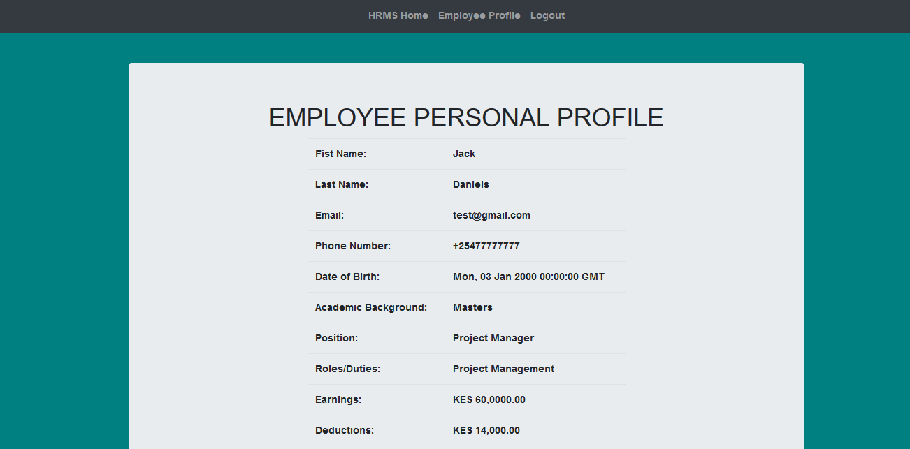

# ReactJS-Flask-MySQL---HRMS

#### A Human Resource Management System to store employee data. 

#### By **Lugaga Maurice Ngulu**

## The Web Application Screengrabs.

* HRMS Landing Page

* Employee Registration Page

* Employee Registration Page

* Employee Login Page

* Employee Profile Page

## BDD

| Behavior | Input  | Output |
| :-------------: | :-------------: | :-------------: |
| Employee registration | Click on register  | Employee Registered |
| Employee login | Click on login | Employee logged in |

## Setup/Installation Requirements

* Clone Project to your machine `git clone `
* Install all the requirements found in requirements file : `pip install -r requirements.txt` : `npm install`
* On your terminal run `python mysqlloginreg.py` : `npm start`
* Access the live site using the [local host]()

## Technologies Used

* Python3.6.
* Flask.
* ReactJs.
* MySQL.
* CSS3 for styling.
* HTML5 for webpage design.

## Support

* Telephone: +254 (0) 777 685 128
* Email: maureezgaga@outlook.com

### License and Copyright details

* The MIT License [MIT]()
* Copyright (c) 2020 **Engineer Lugaga**

